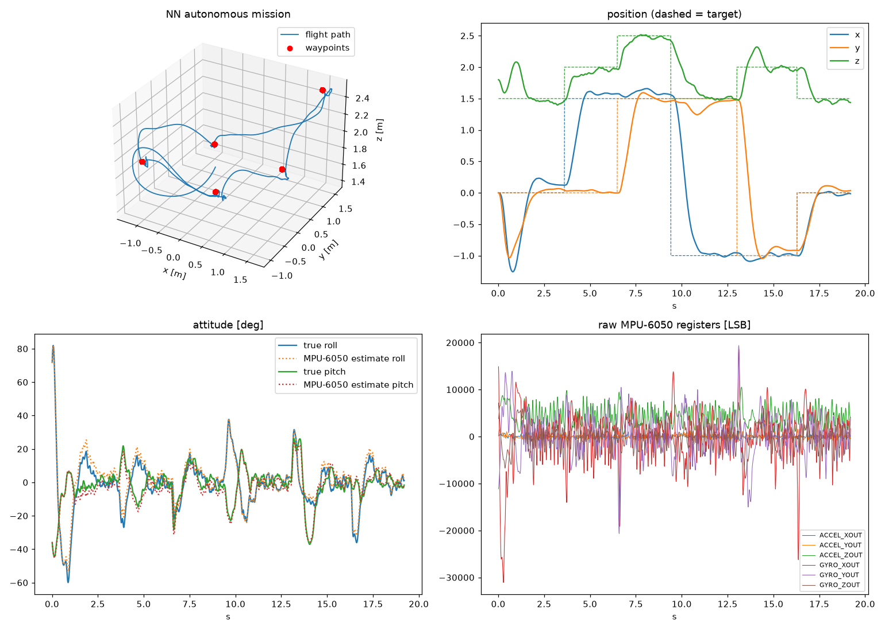

# Drone Flight Simulator + Neural Network Autopilot

A physics simulator for training a neural network to fly a quadcopter on its own. The network learns to
**self-balance** (recover from being thrown at up to 60°, spinning) and **fly autonomously to waypoints**
using the same sensors a real flight controller has: a **simulated MPU-6050** built from the datasheet
numbers, plus a position fix. A **component weight system** lets you change the mass and position of every
part. The simulator then recomputes the centre of mass and inertia tensor exactly.

```
components.json ──► DroneModel (mass, CoM, inertia tensor, rotor geometry)
                         │
                         ▼
   motors ◄── action ── Policy (MLP 25→64→64→4) ◄── observation
     │                                                  ▲
     ▼                                                  │
 RK4 6-DOF rigid-body physics @ 1 kHz ──► MPU-6050 model ──► Mahony AHRS ─┤
 (thrust, drag, wind, rotor gyro, ground)  (int16 registers)               │
                         └──────────────► position sensor (GPS/flow) ──────┘
```

## Quick start

```bash
pip install -r requirements.txt

python scripts/components.py                       # look at the drone's weight breakdown
python -m pytest -q tests                          # physics / sensor correctness tests

python scripts/fly_mission.py --policy models/f450_policy.pt          # fly the pre-trained network
python scripts/fly_mission.py --policy models/f450_policy.pt --throw  # start by throwing it
python scripts/evaluate.py   --policy models/f450_policy.pt           # 200 random episodes, NN vs PID

python scripts/record_flight.py --throw --wind 2 --push 11.5          # record a 3D flight video (MP4/GIF)

python scripts/train.py --steps 30e6 --out runs/my_run                # train your own
```

**3D flight recording:** [`docs/flight_3d.mp4`](docs/flight_3d.mp4). The network is released tumbling at 70°,
steadies itself, flies 6 waypoints in 2 m/s wind and recovers from a sideways shove at 11.5 s. The video shows a
wide scene, a true-scale chase camera, true vs MPU-6050-estimated attitude, motor thrust and raw registers.
`record_flight.py` needs `pip install imageio-ffmpeg`, or use `--out flight.gif`.

On 4 CPU cores training runs at about 7,000 simulated steps/s. The network learns to hover in about 2M
steps (5 minutes). A solid policy that handles wind and pushes needs 20–30M steps (about an hour).

## 3D obstacle course video

[`docs/obstacle_flight.mp4`](docs/obstacle_flight.mp4): the neural network is released tumbling at 70°, steadies
itself, then flies a 25 m course: a pillar forest, a high window, under a low beam, through a low window, a
three-gate slalom, and on to a landing pad, in a 1 m/s crosswind. The layout matches the first video: a scene view
that follows the drone, a true-scale chase camera with a solid drone model, true vs MPU-6050-estimated attitude,
motor output, raw MPU-6050 registers and a top-view minimap.

```bash
pip install imageio-ffmpeg
python scripts/record_obstacles.py                          # docs/obstacle_flight.mp4 (about 8 min to render)
python scripts/record_obstacles.py --set payload=0.2 --wind 1.5 --out runs/heavy.mp4
python scripts/record_obstacles.py --preview 1,11.5,19.5    # PNG stills only
```

How the obstacle avoidance works (`drone_sim/course.py`): the neural network is the low-level pilot and has
no obstacle sensor. An A* planner searches a 3D grid in which every obstacle is inflated by 0.75 m. It
shortcuts the result with line-of-sight checks and smooths it with a Catmull-Rom spline. A "carrot" target
then slides along the path, and the network chases it using the simulated MPU-6050 and position fix. Every
simulation step checks the true distance from the drone's prop tips to the obstacle geometry; any contact
would end the run as a crash.

`scripts/record_course.py` + `render3d/` is an alternative renderer for the same flight: three.js in headless
Chromium (needs `cd render3d && npm install`).

## Results (pre-trained `models/f450_policy.pt`, 30M steps, 200 random episodes each)

Episodes start thrown (up to 60° tilt, spinning), with wind, gusts, random shoves and ±15 % mass randomisation.

| drone | controller | crash rate | median final error | p90 error |
|---|---|---|---|---|
| default F450 (901 g) | **neural net** | **1.0 %** | **7.7 cm** | **18 cm** |
| default F450 (901 g) | cascaded PID | 8.5 % | 16.5 cm | 34 cm |
| + 250 g payload | **neural net** | **2.0 %** | **7.7 cm** | **12 cm** |
| + 250 g payload | cascaded PID | 7.0 % | 13.7 cm | 29 cm |
| battery moved 3 cm forward | **neural net** | **0.5 %** | **7.4 cm** | **16 cm** |
| battery moved 3 cm forward | cascaded PID | 8.5 % | 16.8 cm | 35 cm |



*`fly_mission.py --throw --wind 2`: the drone is released at 70° roll while spinning, recovers in about 1 s, then
flies 6 waypoints. Bottom right shows the simulated raw MPU-6050 registers.*

Known limitation: the policy's motor commands are jittery (bang-bang-ish high-frequency switching). That is
fine in simulation, but on real hardware it heats the motors. Before flying it, raise the action-smoothness
penalty in `env.py` (`0.1 * mean((a - a_prev)²)`) and retrain, or low-pass the outputs.

## 1. Component weight system (`drone_sim/components.py`)

The drone is a list of parts, defined in [`drone_sim/configs/f450_mpu6050.json`](drone_sim/configs/f450_mpu6050.json).
Each part has a `mass` (kg), a `position` (m, body frame: x forward, y left, z up), a `shape` (`point`, `box`,
`cylinder`, `sphere`, `rod`) with a `size`, and an optional `orientation_deg`. Motors and propellers are
generated from the `rotors` section.

The mass properties are computed exactly:

| quantity | formula |
|---|---|
| total mass | `M = Σ mᵢ` |
| centre of mass | `c = Σ mᵢ rᵢ / M` |
| inertia about CoM | `I = Σ [ Rᵢ Iᵢ Rᵢᵀ + mᵢ (‖dᵢ‖² E − dᵢ dᵢᵀ) ]`, `dᵢ = rᵢ − c` (parallel-axis theorem) |

If the CoM is off-centre, thrust produces a real static torque, just like on a real frame. A policy trained
with mass randomisation learns to compensate for it.

```bash
python scripts/components.py --set battery=0.25                  # heavier battery (kg)
python scripts/components.py --set payload=0.2 --set payload@0.03,0,-0.06   # 200 g payload, moved 3 cm forward
python scripts/components.py --set motors=0.07                   # all motors 70 g
python scripts/components.py --add camera=0.045@0.08,0,-0.01     # add a new part
python scripts/components.py --set battery=0.3 --save my_drone.json

python scripts/train.py --config my_drone.json                   # train for that exact airframe
python scripts/evaluate.py --policy models/f450_policy.pt --set payload=0.25   # test robustness
```

The summary reports thrust-to-weight and hover throttle. It warns you if the drone is too heavy to take off
or has too little control authority.

In Python:

```python
from drone_sim import DroneModel
m = DroneModel.from_json()
m.set_mass("battery", 0.22); m.move("battery", [0.01, 0, -0.03]); m.add_component("gps", 0.02, [0, 0, 0.05])
print(m.summary()); m.save("my_drone.json")
```

## 2. MPU-6050 simulator (`drone_sim/sensors/mpu6050.py`)

Based on the *MPU-6000/6050 Product Specification rev 3.4* and *Register Map rev 4.2*:

| effect | model |
|---|---|
| what it measures | accel = specific force `f = a − g` (reads +1 g on Z when level), gyro = body rate |
| lever arm | the IMU sits at its component position: `a_imu = a_cm + α×r + ω×(ω×r)` |
| full-scale ranges | `FS_SEL` ±250/500/1000/2000 °/s → 131/65.5/32.8/16.4 LSB/(°/s); `AFS_SEL` ±2/4/8/16 g → 16384…2048 LSB/g |
| noise | gyro 0.005 °/s/√Hz, accel 400 µg/√Hz, white noise at 1 kHz with σ = ND·√(fs/2) |
| DLPF | `DLPF_CFG` 0–6 (260…5 Hz), 2nd-order Butterworth whose delay matches the datasheet table |
| offsets | ZRO ±20 °/s, zero-g ±50/50/80 mg, or small residuals if `calibrated` |
| scale / cross-axis | ±3 % sensitivity tolerance, ±2 % cross-axis coupling (per-chip random matrix) |
| temperature | die warm-up, bias temperature coefficients, `TEMP_OUT` with `T = raw/340 + 36.53` |
| g-sensitivity | gyro 0.1 °/s/g linear-acceleration sensitivity |
| bias drift | random walk (typical Allan-variance values) |
| digital output | round to LSB, saturate to int16, `SMPLRT_DIV` output rate, zero-order hold |

It exposes the same interface as the chip: `read_raw()` gives int16 `ACCEL_XOUT…GYRO_ZOUT`,
`burst_read()` gives the 14-byte big-endian block from `0x3B`, and `read_register(0x75)` returns `0x68`.
Configure it in the `imu` section of the drone JSON.

The **Mahony complementary filter** (`drone_sim/estimation.py`) fuses gyro and accel into an attitude
estimate, as your firmware would. The network sees this estimate, not the true attitude.

## 3. Physics (`drone_sim/dynamics.py`)

Newton–Euler rigid body, quaternion attitude, **RK4 at 1 kHz**, vectorised over hundreds of drones:

- rotor thrust `T = k_f Ω²`, drag torque `k_m Ω²`, first-order motor lag (ESC + motor time constant)
- thrust torques about the **actual CoM** (from the component system), full 3×3 inertia incl. products
- gyroscopic effects: `ω × (Iω + h_rotors)`, and the motor spin-up reaction torque
- linear + quadratic aerodynamic drag relative to the air, so wind (mean + Ornstein–Uhlenbeck gusts) acts through drag
- random pushes, and ground contact (spring-damper normal force with friction)

The tests check the physics against closed-form results: free fall, hover equilibrium, torque → angular
acceleration, centripetal acceleration at an offset IMU, and resting on the ground.

## 4. Learning (`drone_sim/env.py`, `drone_sim/rl/`)

- **Observation (25):** Mahony rotation matrix (9), MPU gyro (3), MPU accel (3), target − position (3),
  velocity (3), previous action (4). `--obs-mode state` uses perfect state instead, for comparison.
- **Action (4):** one command per motor in [−1, 1]. 0 = hover thrust of the configured drone, −1 = off, +1 = full.
- **Episodes:** 10 s at 100 Hz. The drone starts thrown: ±1 m, ±1 m/s, up to 60° tilt, ±3 rad/s spin. The
  target can jump mid-flight, which trains waypoint following.
- **Domain randomisation:** every component mass ±15 %, position ±1 cm, per-motor thrust ±5 %, motor lag
  ±20 %, drag ±30 %, wind up to 2 m/s plus gusts, random shoves, a fresh MPU-6050 chip each episode.
- **Algorithm:** PPO with GAE, time-limit bootstrapping, observation normalisation and an adaptive-KL
  learning rate. The actor is a small 2×64 tanh MLP (about 6k parameters), so it fits on a microcontroller.

### Deploying on hardware

```bash
python scripts/export_policy.py models/f450_policy.pt --out export/
```

This writes `drone_policy.h`: plain C with the weights, the observation normaliser and a
`drone_policy_forward(obs, action)` function. Its output matches PyTorch bit-for-bit. Feed it the same
observation layout, documented in the header, from your real MPU-6050 and position source.

> Simulation-to-reality transfer is never guaranteed. Measure your real motor thrust curve (`k_f`, `k_m`,
> max RPM, time constant) and put those numbers in the JSON. Test tethered first, with a hardware kill
> switch.

## Project layout

```
drone_sim/
  components.py      component weight system → mass, CoM, inertia
  dynamics.py        RK4 6-DOF multirotor physics
  sensors/mpu6050.py MPU-6050 model (registers, noise, DLPF, biases, temperature)
  sensors/position.py GPS / optical-flow style position + velocity fix
  estimation.py      Mahony attitude filter
  env.py             vectorised RL environment + reward
  controllers/pid.py cascaded geometric PID baseline (same sensors)
  rl/                PPO, networks, deployment Policy wrapper
  configs/           drone definitions (JSON)
scripts/             train, evaluate, fly_mission, components, export_policy
models/              pre-trained policy for the default F450
tests/               physics and sensor validation
```
